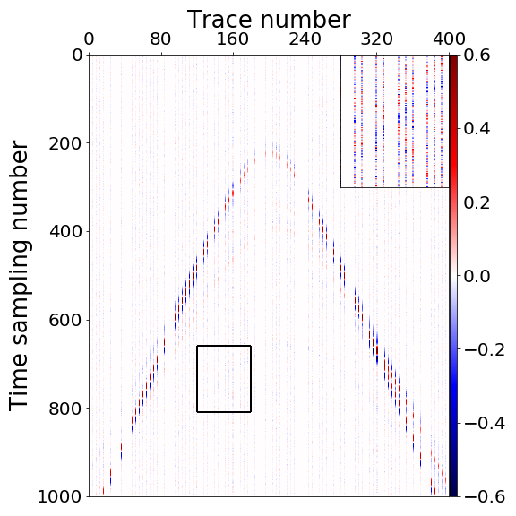
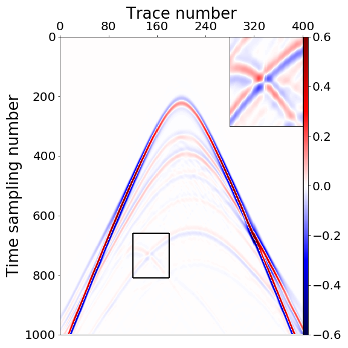
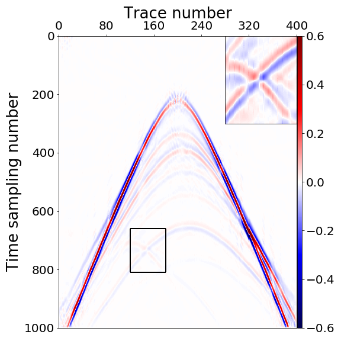
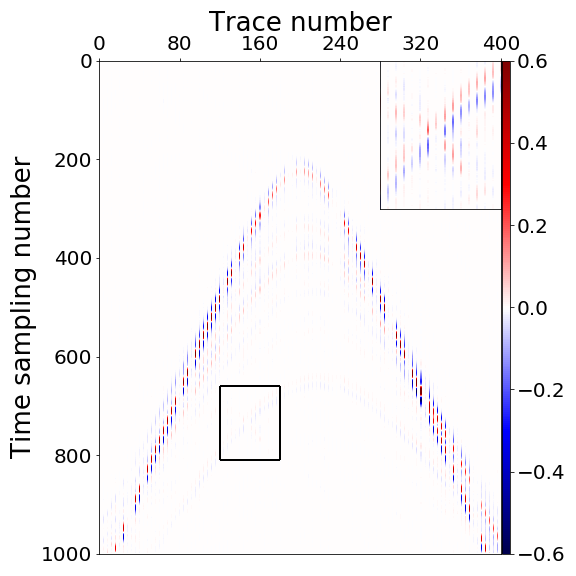
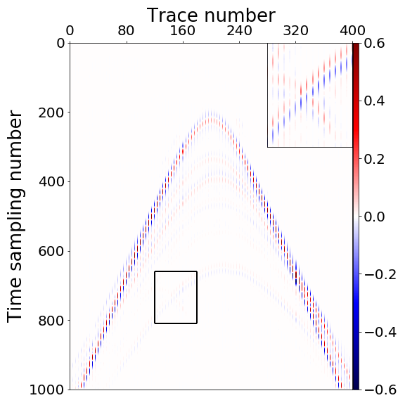

Repository for the paper "**Adapting the residual dense network for seismic data denoising and upscaling**"

# Usage
This is a supervised learning approach, consisting of 3 steps:

## Step 1: Generating training data
You can generate training data in any way you prefer. We utilized the Python package [Devito](https://www.devitoproject.org/) to generate the training data.

## Step 2: Training
**train.py** is a framework for training process. Before using it, you need to make some modifications. First, you need to load your own training data in the **train.py**. Additionally, you can also adjust some hyperparameters.

## Step 3: Testing
**test.py** is a framework for testing process. You need to load your own testing data in the **test.py**.

# Description

- **Random_noise.py/Coherent_noise.py/Missing_trace.py/Super_resolution.py** files are the neural network modules for each task.

- The **parameter.py** file contains data address and hyperparameters.

# Results:

| Corrupted data |          Ground truth                         |  Curvelets                         |
| :-----------: | :----------------------------------------------------------: | :----------------------------------------------------------: |
|            |  |  |

| Ours-step1-denoise |      Ours-step2-interpolation                     |  Ours-step3-super resolution                       |
| :-----------: | :----------------------------------------------------------: | :----------------------------------------------------------: |
|            |  |  |

# Citation

BibTex

    @article{wang2022adapting,
        title={Adapting the residual dense network for seismic data denoising and upscaling},
        author={Wang, Rongqian and Zhang, Ruixuan and Bao, Chenglong and Qiu, Lingyun and Yang, Dinghui},
        journal={Geophysics},
        volume={87},
        number={4},
        pages={V321--V340},
        year={2022},
        publisher={Society of Exploration Geophysicists}
    }